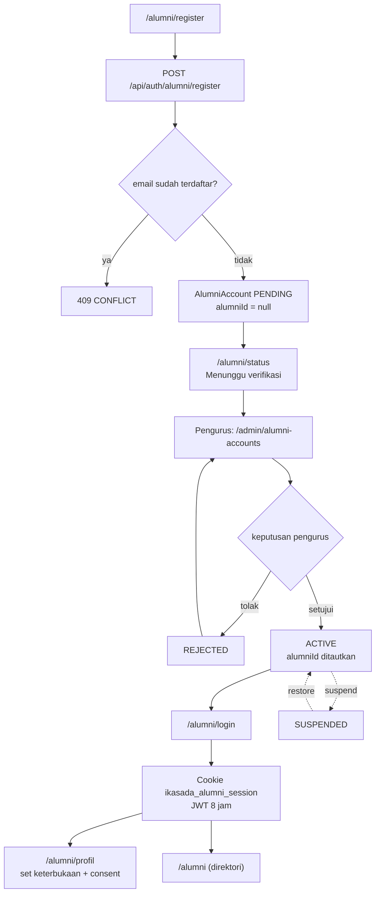
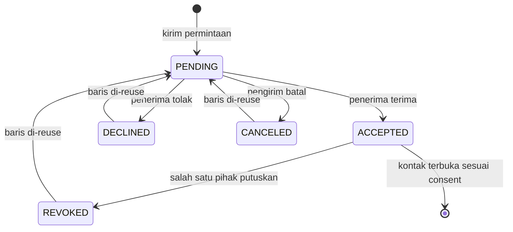
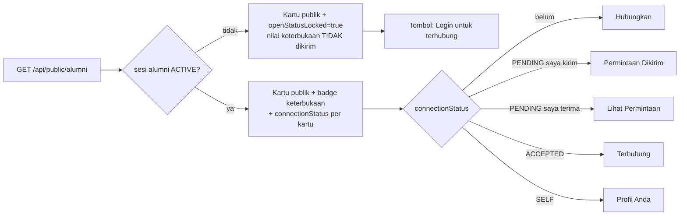
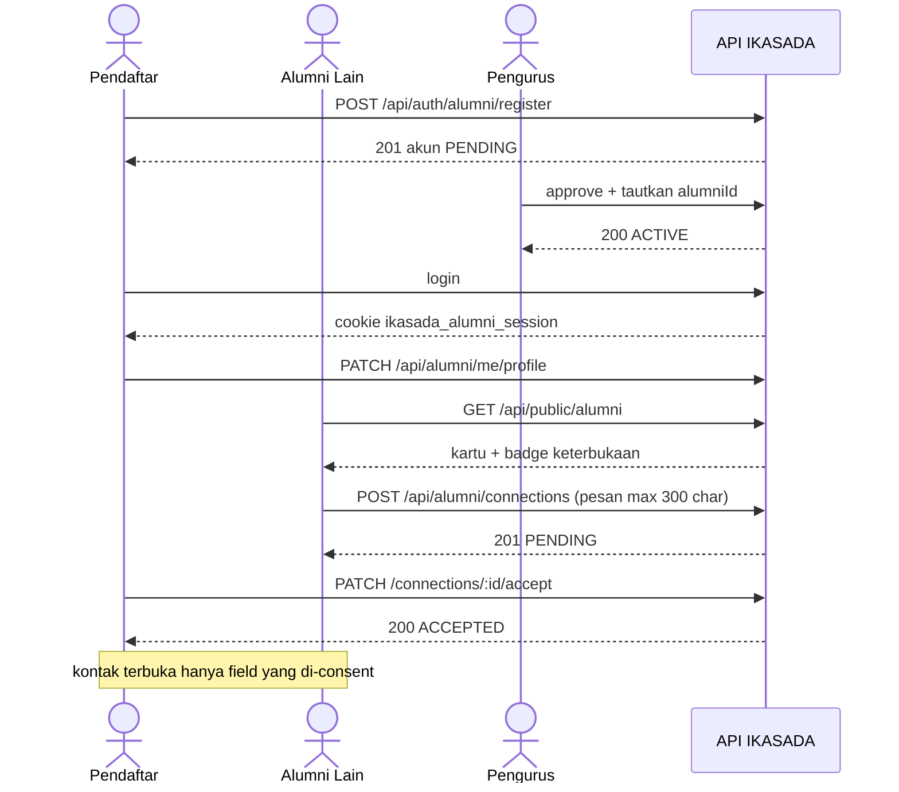

# Alur Fitur Jejaring Alumni IKASADA

Referensi visual untuk fitur akun alumni, status keterbukaan, dan koneksi.
Menggambarkan implementasi yang berjalan sekarang (Fase A–G selesai).
Status keterbukaan hanya terlihat oleh sesi alumni `ACTIVE`; kontak hanya
terbuka pada koneksi `ACCEPTED` sesuai consent per-field pemiliknya.

## 1. Perjalanan akun alumni (daftar -> verifikasi -> aktif)

## 2. Siklus hidup koneksi (state machine)

## 3. Visibilitas direktori + tombol per peran

## 4. Urutan lintas tiga POV (pendaftar . alumni lain . pengurus)

## 5. Ringkas endpoint & peran

| Aksi | Anonymous | Pending | Active | Admin |
|---|---:|---:|---:|---:|
| Lihat data publik alumni | Ya | Ya | Ya | Ya |
| Lihat status keterbukaan | Tidak | Tidak | Ya | Tidak |
| Register | Ya | Tidak | Tidak | Tidak |
| Login alumni | Ya | Ya | Ya | Tidak |
| Ubah status sendiri | Tidak | Tidak | Ya | Tidak |
| Kirim/terima/tolak koneksi | Tidak | Tidak | Ya | Tidak |
| Approve / reject / suspend akun | Tidak | Tidak | Tidak | Ya |

Guard: `/alumni/status` pakai `akunAlumniHalaman()`; `/alumni/jejaring` & `/alumni/profil`
pakai `akunAlumniAktifHalaman()` + `requireAlumniAktif()` (status dibaca ulang dari DB).
